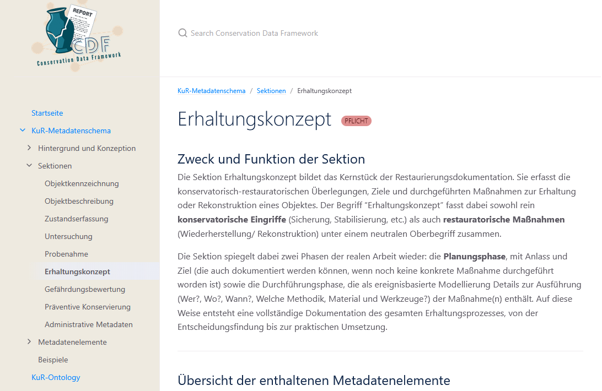
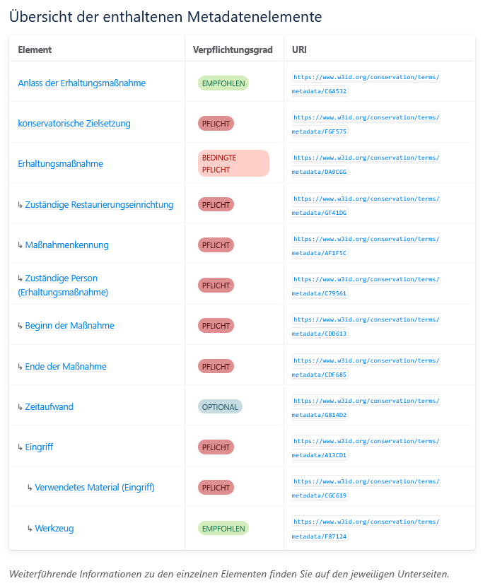

<!--
author: Canan Hastik und Gudrun Schwenk
email: soda@sammlungen.io

title: SODa BeratungsCamp - Einheit 1
version: v1.0.0
language: DE

icon:     https://raw.githubusercontent.com/chastik/Beratung_Dateityp_Bild/refs/heads/main/SODa-Logo_full.svg
link:     https://raw.githubusercontent.com/soda-collections-objects-data-literacy/SODaBeratungsCamp_Modul1/refs/heads/main/soda.css
          https://fonts.googleapis.com/css?family=Noto+Sans

comment: Dieses Modul [Text ergänzen]
-->

# SODa BeratungsCamp 

**Modul 2: Analyse und Strukturierung von Konservierungs- und Restaurierungsdaten am Beispiel medienarchäologischer Erschließung**

Einheit 1: **Das KuR-MDS als Werkzeug zur Strukturierung von Konservierungs- und Restaurierungsdaten**  

**Dauer:** ~ 10 Min.

---

## Lernziele

Lernende können...

---

## Voraussetzung

*keine*

---

## 1.1 Was sind Metadaten und Metadatenschemata

> **Hinweis:**  
> Im folgenden übernommen aus dem [SODa Selbstlernkurs: Einführung (Digitale) Provenienzforschung. Themenblock 3 - Strukturierung von Provenienzangaben](https://liascript.github.io/course/?https://raw.githubusercontent.com/soda-collections-objects-data-literacy/Einfuehrung-in-die-Digitale-Provenienzforschung/main/OER-Einfuehrung-DPF_v1.0.md#1). [1]

---

> **Definition:**
> 
> **"Metadaten beinhalten strukturierte Informationen über Daten (z. B. Forschungsdaten) oder andere Ressourcen und deren Merkmale. Sie werden entweder unabhängig von oder zusammen mit den Daten, die sie beschreiben, abgespeichert."** [2]

Metadaten sind vereinfacht gesagt "Daten über Daten". Sie enthalten strukturierte Informationen über Daten, Objekte oder andere Ressourcen und machen diese identifizierbar, auffindbar und interpretierbar.

Im Forschungsdatenmanagement werden häufig verschiedene Arten von Metadaten unterschieden.

- **Deskriptive Metadaten** beschreiben ein Objekt und seinen Kontext.

- **Administrative Metadaten** regeln organisatorische, rechtliche oder technische Rahmenbedingungen.

- **Technische Metadaten** beschreiben die digitale Datei, nicht das Objekt selbst.

- **Strukturelle Metadaten** beschreiben, wie einzelne Informationen verknüpft sind.

Ein **Metadatenschema** legt fest, welche Informationen zu einem Objekt oder einer Ressource erfasst werden, wie diese Informationen benannt werden und welche Felder verpflichtend oder wiederholbar sind.

---

## 1.2 Relevanz von Metadaten und Metadatenschemata in der Konservierungs- und Restaurierungsdokumentation

Die Konservierungs- und Restaurierungsdokumentation umfasst häufig **heterogene Informationen und Daten**, die in **unterschiedlichen Formen, Datentypen und Dateiformaten** vorliegen und in **unterschiedlichen fachlichen Zusammenhängen** entstehen. So können etwa schriftliche Restaurierungsberichte, Fotografien, Röntgenaufnahmen, Messdaten oder Zeichnugnen Bestandteil einer Dokumentation sein. Damit die unterschiedlichen Informationen über ihren ursprünglichen Dokumentationszusammenhang hinaus **auffindbar**, miteinander **verknüpfbar** und **nachnutzbar** werden, bedarf es einer **nachvollziehbaren und systematischen Strukturierung**.

- **Metadaten** ermöglichen es, solche Informationen zu beschreiben, zu kontextualisieren und gezielt auffindbar zu machen.

- **Metadatenschemata** schaffen dafür eine gemeinsame fachliche Struktur, indem sie Regeln festlegen, welche Informationen erfasst und definieren, wie sie einheitlich beschrieben werden können.

---

## 1.3 Das Metadatenschema für die Dokumentation von Konservierungs- und Restaurierungsmaßnahmen (KuR-MDS)

Das **Metadatenschema für die Dokumentation von Konservierungs- und Restaurierungsmaßnahmen (KuR-MDS)** wurde von den Mitgliedern der **NFDI4Objects-TWG "Community-Standards für kontrollierte Vokabulare und Austauschformate im Bereich der Erhaltung und Pflege des kulturellen Erbens"** [3] in einem iterativen Prozess und unter enger Rückbindung an die Fachcommunity entwickelt. 

> **Hinweis:**
>
> Das KuR-MDS befindet sich momentan noch in Entwicklung. Nach Finalisierung des inhaltlichen Schematas durch Community-Feedback folgt die Entwicklung der technischen Umsetzung (Stand 08.09.2026). [4] & [5]

---

## 1.4 Aufbau und grundlegende Begriffe des KuR-MDS

- **modulare Struktur:** Die zu konservierenden und restaurierenden Objekte stammen aus unterschiedlichen kulturellen und historischen Kontexten und unterscheiden sich entsprechend in Material, Funktionl, Erhaltungszustand und -anforderungen. Zudem werden Objekte häufig nur partiell und im Rahmen konkreter Ausstellungs-, Forschungs- oder anderer Vorhaben bearbeitet. Die Restaurierungsprozesse und ihre Dokumentationen sind daher sehr unterschiedlich und umfassen nicht immer alle Aspekte des Restaurierungsprozesses. Das KuR-MDS ist deshalb modular aufgebaut und ermöglicht eine bedarfsgerechte Dokumentation der jeweils relevanten Informationen [6].

- **Sektionen:** Der KuR-MDS strukturiert die grundlegenden "Prozesse im Umgang mit Kunst- und Kulturgut im Kontext konservatorisch-restauratorischer Arbeiten" [6] in **elf übergeordnete Kategorien**, die als Sektionen bezeichnet werden. Die einzelnen Sektionen umfassen jeweils spezifische **Metadatenelemente**, denen ein **Verpflichtungsgrad** und zugeordnet ist [6].

- **Verpflichtungsgrade:** Für die Sektionen und Metadatenelemente des KuR-MDS sind unterschiedliche Verpflichtungsgrade definiert. Ingesgesamt gibt es **vier Verpflichtungsgrade** [6]:

  - **Pflicht:** Das Metadatenelement ist in jeder vollständigen Restaurierungsdokumentation zu erfassen.
    
  - **Bedingte Pflicht:** Das Metadatenelement ist unter bestimmten Umständen verpflichtend zu erfassen, wenn die entsprechenden Maßnahmen Bestandteil des zu dokumentierenden restauratorischen Prozesses sind.
    
  - **Empfohlen:** Das Metadatenelement bezieht sich auf Informationen, die aus einer soezifischen fachlichen Sicht relevant sind. Ihr Fehlen beeinträchtigt das grundsätzliche Verständnis der Dokumentation nichtm ihre Erfassung verbessert jedoch deren Qualität und Nachnutzbarkeit.
    
  - **Optional:** Das Metadatenelement dient der Erweiterung des KuR-MDS für spezifische Fachdisziplinen und Arbeitskontexte sowie für einen kontextspezifischen Ausbau der Dokumentation.
  
- **Conservation Metadata Terminology:**[7] Sowohl die Sektionen als auch die Metadatenelemente sind in der Conservation Metadata Terminology definiert. Die Definitionen umfassen unter anderem folgende Angaben: **Begriffsdefinition, Verpflichtungsgrad, Feldwert, Wiederholbarkeit, Verwendungshinweis sowie eine eindeutige URI**.

> **Hinweis:**  
> 
> Detallierte Informationen zu Hintergrund, fachlichem und konzeptuellen Rahmen sowie Nachnutzung des KuR-MDS bietet das [NFDI4Objects Conservation Data Framework Online-Portal](https://nfdi4objects.github.io/n4o_conservation_data_framework/). Die dort bereitgestellte Dokumentation umfasst eine detaillierte Beschreibung von Zweck und Funktion der einzelnen Sektionen sowie einen Überblick über die und eine Beschreibung der in den jeweiligen Sektionen enthaltenen Metadatenelemente, den Verpflichtungsgrad und die dazugehörigen URIs. Die im Conservation Data Framework bereitgestellten Inhalte stehen unter der CC BY 4.0-Lizenz und können unter Angabe der Quelle frei nachgenutzt werden.

---

## 1.5 Überblick über die Sektionen

| Sektionen | Verpflichtungsgrad | URI (Conservation Metadata Terminology) |
|--------|--------|------|
| Objektkennzeichnung | Pflicht | https://www.w3id.org/conservation/terms/metadata/B51DAF |
| Objektbeschreibung | Pflicht | https://www.w3id.org/conservation/terms/metadata/DA2D73 |
| Zustandserfassung | Pflicht | https://www.w3id.org/conservation/terms/metadata/F52262 |
| Untersuchung | Bedingte Pflicht | https://www.w3id.org/conservation/terms/metadata/B3FCA1 |
| Probenahme | Bedingte Pflicht | https://www.w3id.org/conservation/terms/metadata/CD5C3 |
| Erhaltungskonzept | Pflicht | https://www.w3id.org/conservation/terms/metadata/BAA258 |
| Gefährdungsbewertung | Bedingte Pflicht | https://www.w3id.org/conservation/terms/metadata/BAA258 |
| Präventive Konservierung | Empfohlen | https://www.w3id.org/conservation/terms/metadata/C93638 |
| Administrative Metadaten | Pflicht | https://www.w3id.org/conservation/terms/metadata/AC16G1 |
| Verwendete Literatur | Optional | https://www.w3id.org/conservation/terms/metadata/F2AG55 |

> Quelle: [NFDI4Objects Conservation Data Framework Online-Portal](https://nfdi4objects.github.io/n4o_conservation_data_framework/)

---

## 1.6 Beispiel: Sektion Erhaltungskonzept

>**Abbildung:** Beschreibung von Zweck und Funktion der Sektion *Erhaltungskonzept* aus dem [CDF Online-Portal](https://nfdi4objects.github.io/n4o_conservation_data_framework/conservation_metadataschema/1_section_overview/06_conservation_plan.html)

>**Abbildung** Überblick über die Metadatenelemente der Sektion *Erhaltungskonzept* mit entsprechenden Verpflichtungsgraden und Conservation Metadata Terminology-URIs

---

## 1.7 Weiterführende Hinweise und wichtige Links 

**NFDI4Objects Conservation Data Framework (CDF):**

- **Github-Repositorium:** https://github.com/nfdi4objects/n4o_conservation_data_framework
  
- **Online-Portal:** https://nfdi4objects.github.io/n4o_conservation_data_framework/

**Conservation Metadata Terminology:**

- **Katalog:** https://conservationdata.github.io/terms/metadata.html

**Mockup-App für Konservierungsdaten:**   
Beispielhafte Eingabemaske zur Erfassung von Konservierungs- und Restaurierungsdaten auf Basis des KuR-MDS. 

- https://conservationdata.github.io/docu/#/

> Hinweis:  
> Die Angebote wurden innerhalb der Temporary Working Group Community-Standards für kontrollierte Vokabulare und Austauschformate im Bereich der Erhaltung und Pflege des kulturellen Erbes innerhalb des Konsortiums NFDI4Objects entwickelt.

---

## 1.8 Ausblick

---

## Quellenangaben

[1] Zöllner, G., & Reichert, R. (2026). Selbstlernkurs: Einführung in die Digitale Provenienzforschung (Version v1.0) [Computer software]. Zenodo. https://doi.org/10.5281/zenodo.22296350

[2] Kommunikations-, Informations-, Medienzentrum (KIM) der Uni Konstanz. (2026). Metadaten. In Forschungsdaten.info: Praxis kompakt Glossar. https://forschungsdaten.info/praxis-kompakt/glossar/#c269911 (Stand: 17.03.2026)

[3] Fella, K., Lefeldt, J., Mempel-Länger, L., Puhl, A., & Witt, N. (2024). Community-Standards für kontrollierte Vokabulare und Austauschformate im Bereich der Erhaltung und Pflege des kulturellen Erbes. Zenodo. https://doi.org/10.5281/zenodo.14135529

[4] Mempel-Länger L., Fischer, K., Witt, N., Gulbins, G., Schwenk, G. A., Schoel, E., & Zettner, H. (2025). Standardisierung der Konservierungs-Restaurierungs-Dokumentation - Minimaldatensatz für die Dokumentation von Konservierungs- und Restaurierungsmaßnahmen (KuR-MDS) [Graphic]. Zenodo. NFDI4Objects Community Meeting 2025, Bochum. https://doi.org/10.5281/zenodo.17151310

[5] Fischer, K., & Lasse Mempel-Länger. (2025, October 16). Aufbau eines Minimalmetadatensatzes für die Konservierung-Restaurierung. Zenodo. SODa Forum. https://doi.org/10.5281/zenodo.17367214

[6] NFDI4Objects Conservation Data Framework Online Portal. (o. D.). Die thematischen Sektionen des KuR Metadatenschemas. https://nfdi4objects.github.io/n4o_conservation_data_framework/conservation_metadataschema/1_section_overview/ (Stand: 08.09.2026)

[7] Hagel, F. v. (2025). Konservierung/Restaurierung (Metadatenvokabular). https://museumsvokabular.de/metadatenvokabular-konservierung-restaurierung/ (Stand: 08.09.2026)

---

### Metadaten

author: Canan Hastik

orcid: https://orcid.org/0000-0003-1729-4642

email: c.hastik@igsd-ev.de

author: Gudrun Schwenk

orcid: https://orcid.org/0009-0002-3156-8339

email: g.schwenk@igsd-ev.de

sessiontitle: Analyse und Strukturierung von Konservierungs- und Restaurierungsdaten am Beispiel medienarchäologischer Erschließung

sessionnumber: 2

unittitle: Das KuR-MDS als Werkzeug zur Strukturierung von Konservierungs- und Restaurierungsdaten

unitnumber: 1

duration unit: 10 Minuten (PT0H10M)

rights: CC-BY 4.0

rights description: Dieses Material steht unter der Lizenz Creative Commons Attribution 4.0 International.

rights link: https://creativecommons.org/licenses/by/4.0/

SODaformat: SODa Workshop, SODa Train-the-Trainer

SODagestaltungsprinzip: Forschendes Lernen

classification: Forschende, Sammlungsleitende und -betreuende. Technisches admin Personal, Hilfskräfte, Interessierte

classification description: basierend auf SODaPersonas-Beschreibungen, Reichert R., Hastik, C., Gnyp, A., Markert, M., & Tharandt, L. (2025). SODa Personas. Zenodo. https://doi.org/10.5281/zenodo.15574575

mediatype: Text

technical format: Markdown mit LiaScript-Erweiterungen

file format: .md | MIME: text/markdown

software: LiaScript

runtime environment: https://liascript.github.io

keywords: sammlungsbezogenes Forschungsdatenmanagement; Konservierung; Restaurierung; Dokumentation

references: 
