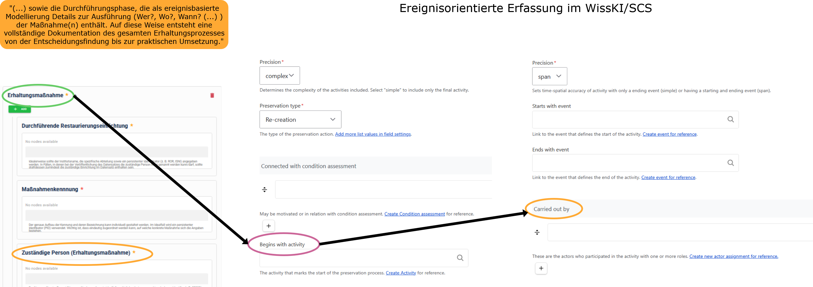

<!--
author: Canan Hastik und Gudrun Schwenk
email: soda@sammlungen.io

title: SODa BeratungsCamp - Einheit 1
version: v1.0.0
language: DE

icon:     https://raw.githubusercontent.com/chastik/Beratung_Dateityp_Bild/refs/heads/main/SODa-Logo_full.svg
link:     https://raw.githubusercontent.com/soda-collections-objects-data-literacy/SODaBeratungsCamp_Modul1/refs/heads/main/soda.css
          https://fonts.googleapis.com/css?family=Noto+Sans

comment: Dieses Modul [Text ergänzen]
-->

# SODa BeratungsCamp 

**Modul 2: [Titel des Moduls]**  

Einheit 3: **Modellierung und Erfassung in WissKI/SCS als graphbasierte Datenstruktur**  

**Dauer:** ~ 45 Min.

---

## Lernziele

Lernende können...

---

## Voraussetzung

*keine*

---

## 3.1 Ereignisorientierte Erfassung von Konservierungs- und Restaurierungsmaßnahmen im WissKI/SCS

**Ereignisorientierte Datenerfassung im SCS**

Für die digitale Erfassung von Konservierungs- und Restaurierungsdaten wird im Folgenden der **Semantic Coworking Space (SCS)** als eine von SODa entwickelte cloudbasierte Arbeitsumgebung vorgestellt. Der SCS stellt verschiedene digitale Werkzeuge für die Arbeit mit Sammlungsdaten bereit, darunter die virtuelle Forschungsumgebung **WissKI (WissenschaftlicheInfrastruktur)** zur **strukturierten Erfassung und Modellierung von Daten**. [x] Neben einem grundlegenden Datenmodell stehen dabei auch **fachspezifische Modellierungen**, sogenannte *Flavours*, zur Verfügung. Das im SCS verwendete Modell für Konservierungs- und Restuarierungsdaten [x] orientiert sich an dem zuvor eingeführten KuR-MDS [Link einfügen].

Konservierungs- und Restaurierungsmaßnahmen sind **zeitlich begrenzte Ereignisse**, die sich auf ein oder mehrere Objekte beziehen und in deren Verlauf unterschiedliche Informationen zusammenkommen können. [x] Dazu gehören beispielsweise beteiligte Personen, verwendete Materialien und Werkzeuge, durchgeführte Untersuchungen, beobachtete Zustandsveränderungen sowie fachliche Bewertungen und Entscheidungen. Für die digitale Erfassung bedeutet dies, dass eine **Restaurierungsmaßnahme nicht lediglich als Eigenschaft eines Objekts erfasst wird, sondern als eigenständiges Ereignis, mit dem die jeweils relevanten Informationen verknüpft werden**. 

Die in WissKI/SCS verwendete Modellierung orientiert sich dabei am **CIDOC Conceptual Reference Model (CIDOC CRM)** [x], das Beschreibungen komplexer Zusammenhänge im Bereich des Kulturellen Erbes über Ereignisse und die zwischen ihnen bestehenden Beziehungen ermöglicht. [x] Die ereigniszentrierte Modellierung bietet damit eine Möglichkeit, die unterschiedlichen Informationen, die im Verlauf einer Konservierungs- oder Restaurierungsmaßnahme entstehen, systematisch miteinander in Beziehung zu setzen.

**Perspektivwechsel bei der Dateneingabe**

Diese ereigniszentrierte Perspektive ist für die Datenerfassung zunächst ungewohnt: Statt ausschließlich vom Objekt und seinen Eigenschaften auszugehen, steht das **Ereignis der Konservierungs- und Restaurierungsmaßnahme** im Mittelpunkt. Für die Erfassung im WissKI/SCS bedeutet dies, die jeweiligen Maßnahme zunächst als Ereignis zu denken und zu erfassen und die daran beteiligten Objekte, Personen, Materialien, Werkzeuge, Untersuchungen und weiteren Informationen mit diesem Ereignis in Beziehung zu setzen.

---

## 3.2 Ereignisorientierte Perspektive bei der Datenerfassung am Beispiel

**Vom KuR-MDS zur Eingabemaske**

Die erste Abbildung zeigt einen Ausschnitt des Beschreibungstextes der **Sektion "Erhaltungskonzept"** sowie die zugehörigen **Metadaten aus dem KuR-MDS**. Dazu gehören beispielsweise **"Anlass der Erhaltungsmaßnahmen"** und 
**"Konservatorische Zielsetzung"** (Planungsphase) sowie Angaben zur **"Erhaltungsmaßnahme"** selbst, etwa die **"Zuständige Person"** (Durchführungsphase). In der Mockup-App werden diese Metadaten in Form einer Eingabemaske visualisiert, die einer **vertrauten Erfassungsoberfläche** entspricht. Die einzelnen **Erfassungsfelder sind hierarchisch angeordnet** und bilden die im KuR-MDS definierte Struktur ab.

   

>**Abbildung:** Ausschnitt des KuR-MDS als hierarchisch strukturierte Eingabemaske in der Mockup-App

   
**Von der Eingabemaske zurm Ereignismodell**

Die erste Abbildung zeigt noch eine Erfassungslogik, die einer klassischen Eingabemaske entspricht. Die zweite Abbildung macht dagegen sichtbar, wie diese fachlichen Angaben im WissKI/SCS auf Grundlage des zugrunde liegenden Datenmodells erfasst werden. **Der im KuR-MDS als "Anlass der Erhaltungsmaßnahme** bezeichnete Aspekt wird dabei nicht als einfache Eigenschaft der Maßnahme erfasst, sondern als Bezug zu einem weiteren Ereignis modeliert. Im dargestellten Beispiel wird die Erhaltungsmaßnahme mit einem *Condition Assessment* verknüpft. Die Angabe *Connected with condition assessement* beschreibt diese Beziehung. Über *Create Condition assessment for reference* kann ein entsprechendes Ereignis angelegt und als Bezug zur Erhaltungsmaßnahme erfasst werden.

Damit wird ein zentraler Unterschied zur vertrauten Eingabemaske deutlich: **Bei der Datenerfassung im WissKI/SCS müssen fachliche Angaben teilweise als eigenständige Ereignisse gedacht und erfasst werden.** Der "Anlass" ist somit nicht lediglich eine Information, die in ein Feld eingetragen wird, sondern kann selbst zum Ausgangspunkt einer weiteren Ereignisbeschreibung und ihrer Verknüpfung mit der Erhaltungsmaßnahme werden.

   

>**Abbildung:** Modellierung des "Anlasses der Erhaltungsmaßnahme" als verknüpftes Ereignis im WissKI/SCS

   
**Die "Zuständige Person" als Teil einer Ereignisstruktur**

Die dritte Abbildung zeigt am BVeispiel der "Zuständigen Person (Erhaltungsmaßnahme)", wie eine im KuR-MDS hierarchisch unter der Erhaltungsmaßnahme eingeordnete Information im WissKI/SCS als Teil eine Ereignisstruktur erfasst wird. Während die "Zuständige Person" in der vertrauten Eingabemaske unmittelbar als Angabe zur Erhaltungsmaßnahme erscheint, wird sie im WissKI/SCS über eine dazwischenliegende **Activity** modelliert: Die Erhaltungsmaßnahme (*Preservation*) 
**beginnt mit einer Aktivität** (*Begins with activity*). Für diese Aktivität wird anschließend die ausführende Person über **Carried out by** erfasst.

Auch hier wird deutlich, dass die Erfassung im WissKI/SCS nicht ausschließlich der hierarchischen Anordnung von Eingabefeldern folgt. Die im KuR-MDS als "Zuständige Person" bezeichnete Information wird vielmehr über die Aktivität mit der Erhaltungsmaßnahme verknüpft. Dadurch kann nicht nur festgehalten werden, **wer** an einer Maßnahme beteiligt war, sondern zugleich, **im Zusammenhang mit welcher Aktivität** diese Person beteiligt war.

>**Abbildung:** Ereigniszentrierte Erfassung der "Zuständigen Person" über eine Aktivität im WissKI/SCS.

---

- Vorstellung Datensatz Rave Racer
---

## 3.2 Gemeinsame Aufgabe

- T42 erfassen
  
---

## 3.3 Diskussion

## Quellenangaben

[1] Schwenk, G. A., & Fischer, K. (2025, May 21). SODa Forum: Konservierungs- und Restaurierungsdokumentation gemeinsam weiterdenken - Ontologieentwicklung im Dialog. Zenodo. https://doi.org/10.5281/zenodo.15481743

https://sammlungen.io/kb/scs

---

### Metadaten

author: Canan Hastik

orcid: https://orcid.org/0000-0003-1729-4642

email: c.hastik@igsd-ev.de

author: Gudrun Schwenk

orcid: https://orcid.org/0009-0002-3156-8339

email: g.schwenk@igsd-ev.de

sessiontitle: Analyse und Strukturierung von Konservierungs- und Restaurierungsdaten am Beispiel medienarchäologischer Erschließung

sessionnumber: 2

unittitle: Modellierung und Erfassung in WissKI/SCS als graphbasierte Datenstruktur

unitnumber: 3  

duration unit: 45 Minuten (PT0H45M)

rights: CC-BY 4.0

rights description: Dieses Material steht unter der Lizenz Creative Commons Attribution 4.0 International.

rights link: https://creativecommons.org/licenses/by/4.0/

SODaformat: SODa Workshop, SODa Train-the-Trainer

SODagestaltungsprinzip: Forschendes Lernen

classification: Forschende, Sammlungsleitende und -betreuende. Technisches admin Personal, Hilfskräfte, Interessierte

classification description: basierend auf SODaPersonas-Beschreibungen, Reichert R., Hastik, C., Gnyp, A., Markert, M., & Tharandt, L. (2025). SODa Personas. Zenodo. https://doi.org/10.5281/zenodo.15574575

mediatype: Text

technical format: Markdown mit LiaScript-Erweiterungen

file format: .md | MIME: text/markdown

software: LiaScript

runtime environment: https://liascript.github.io

keywords: sammlungsbezogenes Forschungsdatenmanagement; Konservierung; Restaurierung; Dokumentation

references:
