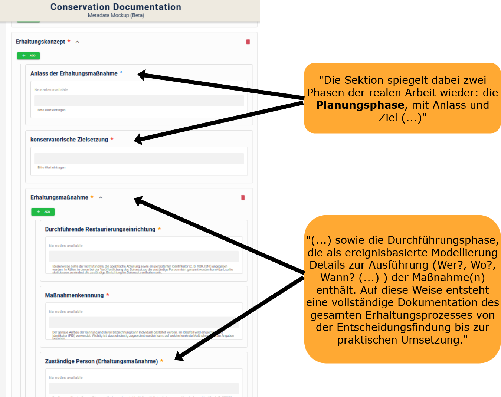
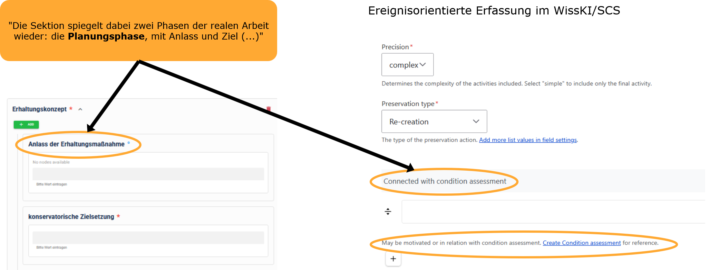

<!--
author: Canan Hastik und Gudrun Schwenk
email: soda@sammlungen.io

title: SODa BeratungsCamp - Einheit 1
version: v1.0.0
language: DE

icon:     https://raw.githubusercontent.com/chastik/Beratung_Dateityp_Bild/refs/heads/main/SODa-Logo_full.svg
link:     https://raw.githubusercontent.com/soda-collections-objects-data-literacy/SODaBeratungsCamp_Modul1/refs/heads/main/soda.css
          https://fonts.googleapis.com/css?family=Noto+Sans

comment: Dieses Modul [Text ergänzen]
-->

# SODa BeratungsCamp 

**Modul 2: [Titel des Moduls]**  

Einheit 3: **Modellierung und Erfassung in WissKI/SCS als graphbasierte Datenstruktur**  

**Dauer:** ~ 45 Min.

---

## Lernziele

Lernende können...

---

## Voraussetzung

*keine*

---

## 3.1 Ereignisorientierte Erfassung von Konservierungs- und Restaurierungsmaßnahmen im WissKI/SCS

**Ereigniszentrierte Datenerfassung im SCS**

Für die digitale Erfassung von Konservierungs- und Restaurierungsdaten wird im Folgenden der **Semantic Coworking Space (SCS)** als eine von SODa entwickelte cloudbasierte Arbeitsumgebung vorgestellt. Der SCS stellt verschiedene digitale Werkzeuge für die Arbeit mit Sammlungsdaten bereit, darunter **WissKI (WissenschaftlicheInfrastruktur)** zur **strukturierten Erfassung und Modellierung von Daten**. Neben einem grundlegenden Datenmodell stehen dabei auch **fachspezifische Modellierungen**, sogenannte *Flavours*, zur Verfügung. Das im SCS verwendete KuR-Modell orientiert sich an dem zuvor eingeführten KuR-MDS.

Konservierungs- und Restaurierungsmaßnahmen sind **zeitlich begrenzte Ereignisse**, die sich auf ein oder mehrere Objekte beziehen und in deren Verlauf unterschiedliche Informationen zusammenkommen können. [1] Dazu gehören beispielsweise beteiligte Personen, verwendete Materialien und Werkzeuge, durchgeführte Untersuchungen, beobachtete Zustandsveränderungen sowie fachliche Bewertungen und Entscheidungen. Für die digitale Erfassung bedeutet dies, dass eine **Restaurierungsmaßnahme nicht lediglich als Eigenschaft eines Objekts erfasst wird, sondern als eigenständiges Ereignis, mit dem die jeweils relevanten Informationen verknüpft werden**. 

Die in WissKI/SCS verwendete Modellierung orientiert sich dabei am **CIDOC Conceptual Reference Model (CIDOC CRM)**, das Beschreibungen komplexer Zusammenhänge im Bereich des Kulturellen Erbes über Ereignisse und die zwischen ihnen bestehenden Beziehungen ermöglicht. Die ereigniszentrierte Modellierung bietet damit eine Möglichkeit, die unterschiedlichen Informationen, die im Verlauf einer Konservierungs- oder Restaurierungsmaßnahme entstehen, systematisch miteinander in Beziehung zu setzen.

**Perspektivwechsel bei der Dateneingabe**

Diese ereigniszentrierte Perspektive ist für die Datenerfassung zunächst ungewohnt: Statt ausschließlich vom Objekt und seinen Eigenschaften auszugehen, steht das **Ereignis der Konservierungs- und Restaurierungsmaßnahme** im Mittelpunkt. Für die Erfassung im WissKI/SCS bedeutet dies, die jeweiligen Maßnahme zunächst als Ereignis zu denken und zu erfassen und die daran beteiligten Objekte, Personen, Materialien, Werkzeuge, Untersuchungen und weiteren Informationen mit diesem Ereignis in Beziehung zu setzen.

---

## 3.2 Beispiel

**Überschrift**

>**Abbildung** Text

   
**Überschrift**

>**Abbildung** Text

---

- Vorstellung Datensatz Rave Racer
---

## 3.2 Gemeinsame Aufgabe

- T42 erfassen
  
---

## 3.3 Diskussion

## Quellenangaben

[1] Schwenk, G. A., & Fischer, K. (2025, May 21). SODa Forum: Konservierungs- und Restaurierungsdokumentation gemeinsam weiterdenken - Ontologieentwicklung im Dialog. Zenodo. https://doi.org/10.5281/zenodo.15481743

https://sammlungen.io/kb/scs

---

### Metadaten

author: Canan Hastik

orcid: https://orcid.org/0000-0003-1729-4642

email: c.hastik@igsd-ev.de

author: Gudrun Schwenk

orcid: https://orcid.org/0009-0002-3156-8339

email: g.schwenk@igsd-ev.de

sessiontitle: Analyse und Strukturierung von Konservierungs- und Restaurierungsdaten am Beispiel medienarchäologischer Erschließung

sessionnumber: 2

unittitle: Modellierung und Erfassung in WissKI/SCS als graphbasierte Datenstruktur

unitnumber: 3  

duration unit: 45 Minuten (PT0H45M)

rights: CC-BY 4.0

rights description: Dieses Material steht unter der Lizenz Creative Commons Attribution 4.0 International.

rights link: https://creativecommons.org/licenses/by/4.0/

SODaformat: SODa Workshop, SODa Train-the-Trainer

SODagestaltungsprinzip: Forschendes Lernen

classification: Forschende, Sammlungsleitende und -betreuende. Technisches admin Personal, Hilfskräfte, Interessierte

classification description: basierend auf SODaPersonas-Beschreibungen, Reichert R., Hastik, C., Gnyp, A., Markert, M., & Tharandt, L. (2025). SODa Personas. Zenodo. https://doi.org/10.5281/zenodo.15574575

mediatype: Text

technical format: Markdown mit LiaScript-Erweiterungen

file format: .md | MIME: text/markdown

software: LiaScript

runtime environment: https://liascript.github.io

keywords: sammlungsbezogenes Forschungsdatenmanagement; Konservierung; Restaurierung; Dokumentation

references:
